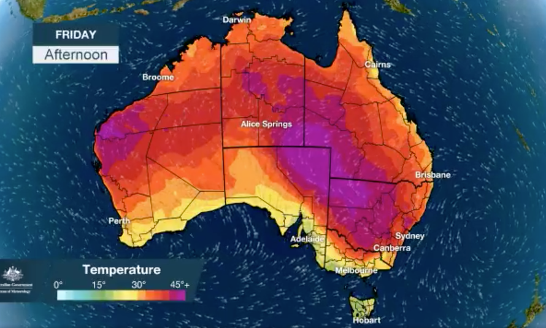

```
├── README.md                           <- The top-level README for reviewers of this project
├── JupyterNotebooks/Jupyter.ipynb      <- Narrative documentation of analysis in Jupyter notebook
├── presentation.pdf                    <- PDF version of project presentation
├── data                                <- Both sourced externally 
└── images                              <- Both sourced externally and generated from code
```

***
# Predict Rain in Australia
** By Yevgeniy Kostrov
***

# Overview 
The purpose of this project is to use weather dataset from Kaggle to predictrainfall for the next day based on the data about today's weather.

During the analysis:
1. I will analyze data.
2. I will deal with missing values.
3. I will build few different classifier and train them.
4. I will select three best classifiers from step 3. and tune them to improve performance.
5. I will test tuned classifiers on the data that would be put aside and not used in the training/validation purposes.

# Business Problem

Predicting rainy weather for the next day is a very important task. It plays a role in farming and other kinds of business, including restaraunts, museums, etc.. Good weather forcast plays important role for turist too. Usually whather is predicted by using complicatd deterministic models envolving partial differential equations. I would like to see how well the rain can be predicted by using Machine Learning.


# Data Description
The file called ['weatherAUS.csv'](data/weatherAUS.csv) holds the data for this project. Taken from Kaggle: "This dataset contains about 10 years of daily weather observations from many locations across Australia. RainTomorrow is the target variable to predict. It means -- did it rain the next day, Yes or No? This column is Yes if the rain for that day was 1mm or more."

#### Column Names and descriptions for Wheather Data Set

* **Date** - date
* **Location** - location
* **MinTemp** - minimum temperature for the day
* **MaxTemp** - maximum temperature for the day
* **Rainfall** - rainfall for the day
* **Evaporation** - evaporation for the day
* **Sunshine** - amount of sunlight
* **WindGustDir** - direction of the wind
* **WindGustSpeed** - speed of wind gust
* **WindDir9am** - wind direction at 9am
* **WindDir3pm** - wind direction at 3pm
* **WindSpeed9am** - wind speed at 9am
* **WindSpeed3pm** - wind speed at 3pm
* **Humidity9am** - humidity at 9am 
* **Humidity3pm** - humidity at 3pm
* **Pressure9am** - atmospheric pressure at 9am
* **Pressure3pm** - atmospheric pressure at 3pm
* **Cloud9am** - cloudiness at 9am
* **Cloud3pm** - cloudiness at 3pm
* **Temp9am** - air temperature at 9am
* **Temp3pm** - air temperature at 3pm
* **RainToday** - does it rain today or not
* **RainTomorrow** - does it rain tomorrow

Source & Acknowledgements
* Observations were drawn from numerous weather stations. The daily observations are available from []http://www.bom.gov.au/climate/data. 

* An example of latest weather observations in Canberra: http://www.bom.gov.au/climate/dwo/IDCJDW2801.latest.shtml

* Definitions adapted from http://www.bom.gov.au/climate/dwo/IDCJDW0000.shtml

* Data source: http://www.bom.gov.au/climate/dwo/ and http://www.bom.gov.au/climate/data.

* Copyright Commonwealth of Australia 2010, Bureau of Meteorology.


